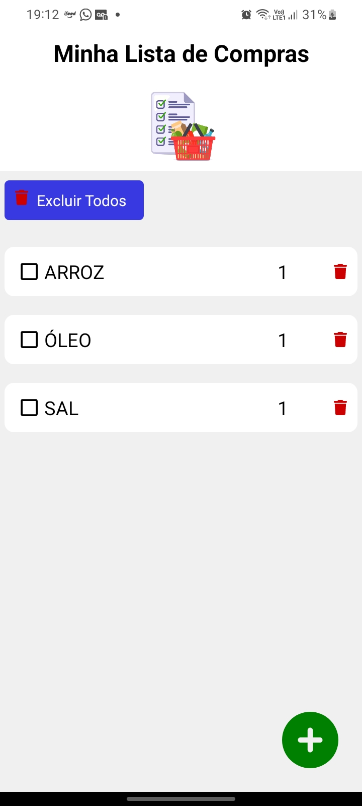
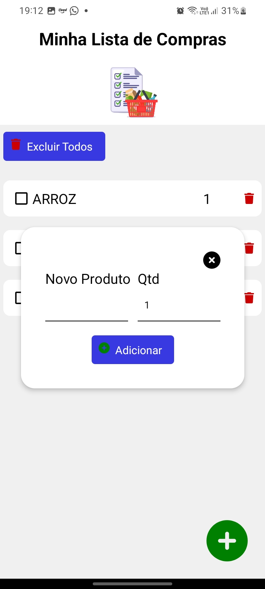

<h4 align="center"> 
	🚧 Minha Lista de Compras 🚀 🚧
</h4>

<p align="center">
 <a href="#-sobre-o-projeto">Sobre</a> •
 <a href="#-funcionalidades">Funcionalidades</a> •
 <a href="#-layout">Layout</a> • 
 <a href="#-como-executar-o-projeto">Como executar</a> • 
 <a href="#-tecnologias">Tecnologias</a> • 
 <a href="#-autor">Autor</a> • 
</p>

## 💻 Sobre o projeto

🧺 Minha Lista de Compras - é um aplicativo criado para anotar os produtos para não esquecer na hora das compras. 

---

## ⚙️ Funcionalidades

- [x] Botão para abrir o formulário
- [x] onde o usuário informa o nome do produto e a quantidade
  - [x] e adiciona na lista
  - [x] pode marcar o produto que já foi pego
  - [x] excluir o produto selecionado
  - [x] limpar a lista de produtos

---

## 🎨 Layout
  
  <p align="center">
    
    	
  </p>

---

## 🚀 Como executar o projeto

```bash

# Para gerar o APK é necessário abrir o terminal na raiz do projeto e acessar a pasta android 
$ cd android

# Rodar o comando
$ ./gradlew assembleRelease

# O APK será gerado e estará na pasta
android\app\build\outputs\apk\release\app-release.apk

```

---

## 🛠 Tecnologias

([React Native](http://www.reactnative.com/)  +  [TypeScript](https://www.typescriptlang.org/))

-   **[Font Awesome](https://fontawesome.com/v5/docs/web/use-with/react-native)**
-   **[Async Storage](https://reactnative.dev/docs/asyncstorage)**
-   **[Checkbox](https://reactnative.dev/docs/checkbox)**
-   **[Toast Message](https://www.npmjs.com/package/react-native-toast-message)**

## 🦸🏻‍♂️ Autor

<a href="https://github.com/gabrielszg">
  <p>@gabrielszg</p>
</a>
